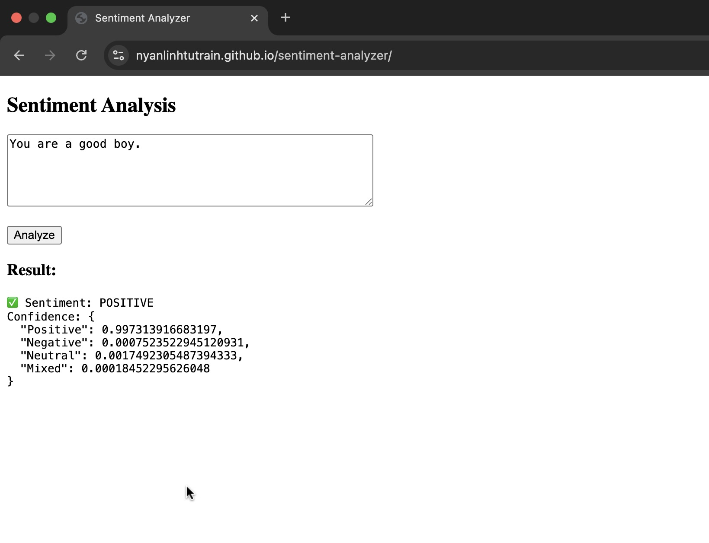
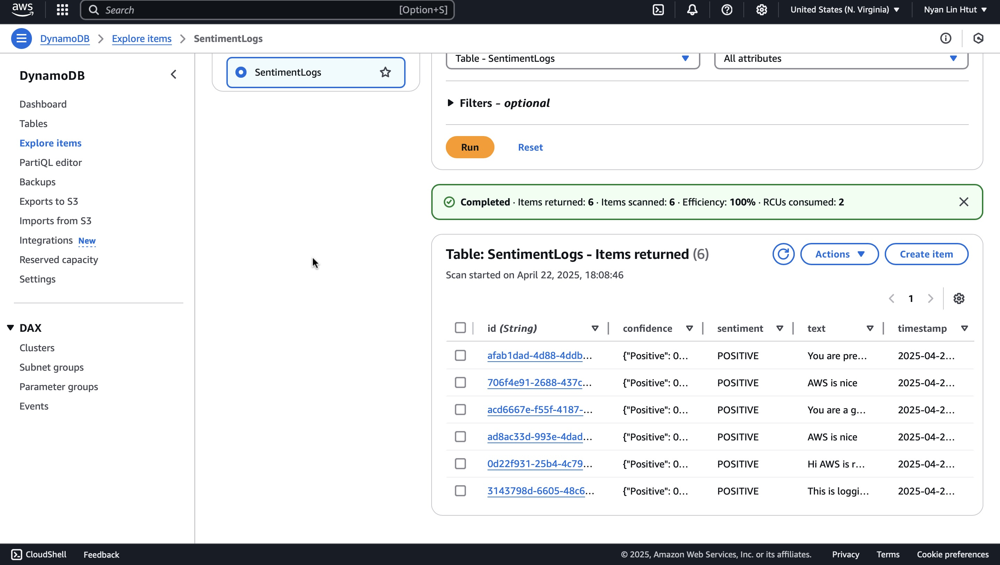
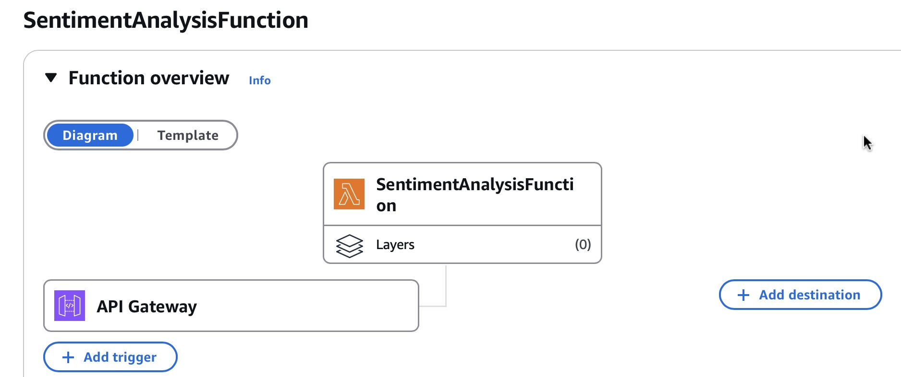

# 💬 AI-Powered Sentiment Analyzer (Serverless on AWS)

This project is a fully serverless web app that performs real-time sentiment analysis using **Amazon Comprehend**, stores results in **DynamoDB**, and delivers an interactive frontend via **GitHub Pages**.

---

## 🔗 Live Demo  
👉 [https://nyanlinhtutrain.github.io/sentiment-analyzer/](https://nyanlinhtutrain.github.io/sentiment-analyzer/)

---

## 🧠 Features

- Real-time sentiment detection: **POSITIVE**, **NEGATIVE**, **NEUTRAL**, **MIXED**
- Backend powered by **AWS Lambda + Amazon Comprehend**
- Logs results to **DynamoDB**
- Hosted on **GitHub Pages** (fully free-tier)
- Clean and simple HTML/JS frontend

---

## 🖼️ Screenshots

### ✅ Sample Sentiment Result  
Shows how the app analyzes text input and returns sentiment with confidence levels.

### ✅ DynamoDB Logging  
Backend logs are stored in DynamoDB with text, sentiment, and timestamp.

---

## ⚙️ Lambda Function Overview

This Lambda function performs three things:
1. Accepts a POST request containing user input
2. Calls Amazon Comprehend to analyze sentiment
3. Logs results to DynamoDB with timestamp and UUID

## ⚙️ Lambda Function Architecture

This is the structure of the backend logic (you can replace this image with your own Lambda setup screenshot from AWS Console).

- Triggered by API Gateway (POST `/sentiment`)
- Runs a Python Lambda function
- Calls Amazon Comprehend
- Writes the result into DynamoDB

---
# 🔧 Tech Stack

Layer	Technology

Frontend	HTML, JavaScript
Backend	AWS Lambda (Python)
AI Engine	Amazon Comprehend
Database	DynamoDB
API Layer	API Gateway (REST)
Hosting	GitHub Pages

# 🧱 Architecture
GitHub Pages → API Gateway → Lambda → Comprehend + DynamoDB

# 🙌 Built By
Rain ☁️ – deployed using AWS Free Tier and GitHub Pages.

---
